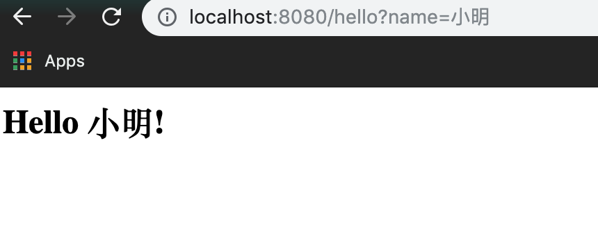

## Spring Boot Web Page基础

### 练习描述
编写hello.jsp文件，并根据不同路由参数显示不同页面,例如

### 环境描述
- java8
- Intellij-IDEA
### 如何开始
- 克隆模版库,在 src/main/webapp/WEB-INF/jsp下完成需求
- 运行DemoApplication文件，若出现 Tomcat started on port(s): 8080 (http) 字样，并能打开localhost：8080页面，说明项目启动成功。
### 输出规范
- 完成需求的代码
- 项目根目录下包含参数为'小红'时的运行截图